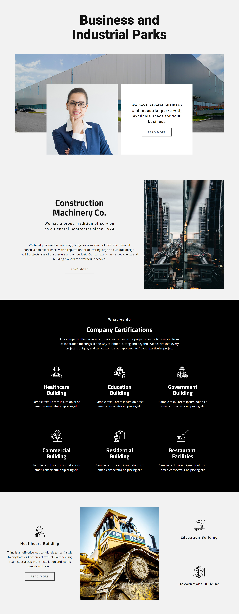

# Triumph-WebProject

[Deployed at: https://robert-schwartz.github.io/Triumph-WebProject/](https://robert-schwartz.github.io/Triumph-WebProject/)

[Github Repo: https://github.com/Robert-Schwartz/Triumph-WebProjectTriumph-WebProject/](https://github.com/Robert-Schwartz/Triumph-WebProject)

## Objective

Create the working HTML/CSS for the template Mockup below.

## Criteria
- Use Bootstrap for the CSS and
- Ensure that it is a responsive design
- Fonts Used:
	* Titillium Web
	* Roboto

## Notes
- To comply with valid HTML requirements I had changed the icon filenames to remove spaces.

## Contact
Contact me with any questions

E-mail: bschwartz23@gmail.com

## Mock Up

